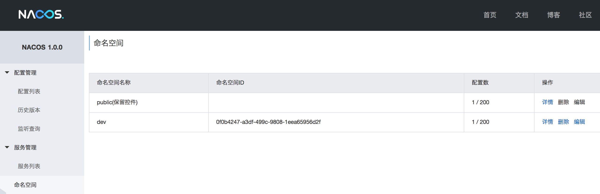
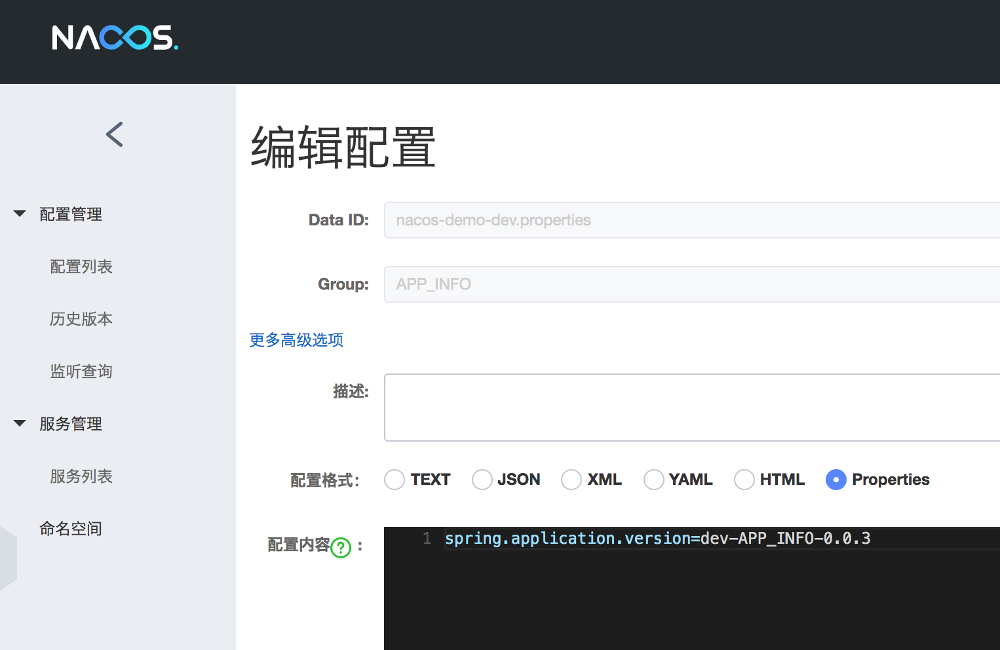

# Spring Cloud 使用 Nacos 作为配置中心

> Spring Cloud 使用 Nacos 作为配置中心和 Spring Boot 的使用方式有很大的差别

## 启动 Nacos

- 使用 Docker 启动，其他的方式可以参考 [https://nacos.io/zh-cn/docs/quick-start.html](https://nacos.io/zh-cn/docs/quick-start.html)

```bash
docker run --name nacos -d -p 8848:8848 -e MODE=standalone nacos/nacos-server
```

## 添加 Nacos 配置

- 添加命名空间(Namespace)



- 添加配置



```properties
spring.application.version=dev-APP_INFO-0.0.3
```

需要注意的是 Data ID 应当是 `${应用名}-${环境}.${文件类型}`，如 `nacos-demo-dev.properties`，详细的信息可以参考[启动配置管理](https://nacos.io/zh-cn/docs/quick-start-spring-cloud.html)


## 创建应用

- 添加依赖 build.gradle 

```gradle
ext {
    springCloudVersion = 'Greenwich.SR1'
    springCloudAlibabaVersion = '0.9.1.BUILD-SNAPSHOT'
}

dependencyManagement {
    imports {
        mavenBom "org.springframework.cloud:spring-cloud-dependencies:${springCloudVersion}"
        mavenBom "org.springframework.cloud:spring-cloud-alibaba-dependencies:${springCloudAlibabaVersion}"
    }
}

dependencies {
    compile('org.springframework.cloud:spring-cloud-starter-alibaba-nacos-config')
}
```

需要注意的是 Spring Boot 2.1 与 Spring Cloud Finchley 版本不兼容，无法自动刷新配置，建议使用 Spring Boot 2.1 +  Spring Cloud Greenwich 或者  Spring Boot 2.0 与 Spring Cloud Finchley


- 添加配置 bootstrap.properties

```properties
spring.application.name=nacos-demo
spring.cloud.nacos.config.server-addr=127.0.0.1:8848
spring.cloud.nacos.config.namespace=0f0b4247-a3df-499c-9808-1eea65956d2f
spring.cloud.nacos.config.group=APP_INFO
spring.cloud.nacos.config.prefix=${spring.application.name}
spring.cloud.nacos.config.file-extension=properties
```

需要注意的是 namespace 是命名空间的 id，不是名称

 - application.properties

```properties
spring.profiles.active=dev
```

- 添加接口 AppInfoController.java

```java
@RestController
@RequestMapping("/app-info")
@RefreshScope
public class AppInfoController {

    @Value("${spring.application.version:empty}")
    private String version;

    @GetMapping
    @ResponseBody
    public String appInfo() {
        return version;
    }
}
```

`@RefreshScope`用于在应用配置更改后刷新当前的上下文，实现配置自动更新

## 测试

- 启动应用 

- 获取属性 

```bash
curl localhost:8080/app-info

dev-APP_INFO-0.0.1
```

- 在 Nacos 中更新配置，将版本号改为 dev-APP_INFO-0.0.2 并发布

```properties
spring.application.version=dev-APP_INFO-0.0.2
```

- 再次获取配置，已经变成了更新后的

```bash
curl localhost:8080/app-info

dev-APP_INFO-0.0.2
```


----------

### 参考资料 

- [配置项无法自动刷新](https://github.com/spring-cloud-incubator/spring-cloud-alibaba/issues/240)
- [Nacos Spring Cloud 快速开始](https://nacos.io/zh-cn/docs/quick-start-spring-cloud.html)