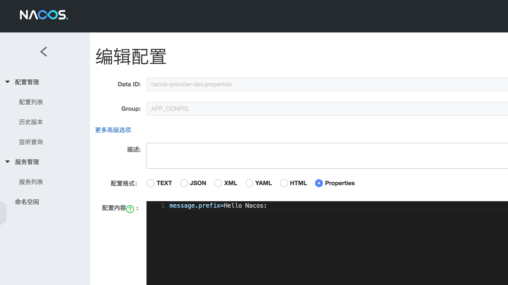
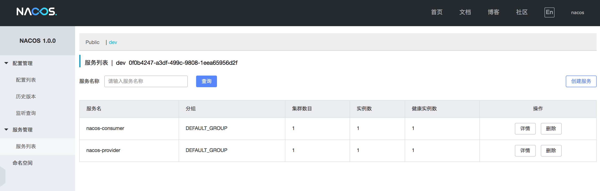

# Spring Cloud 使用 Nacos 作为服务注册中心

> 使用 Nacos 作为服务的注册中心，作为配置中心的相关设置部分可以参考 [Spring Cloud 使用 Nacos 作为配置中心](https://github.com/helloworlde/spring-cloud-alibaba-component/tree/master/cloud-config)

两个应用，Consumer 向 Provider 发起请求，完成后返回给 Consumer

## 添加配置

- 添加 Provider 的配置

添加 Data ID 为 `nacos-provider-dev.properties`， Group 为 `APP_CONFIG`的配置 

```properties
message.prefix=Hello Nacos: 
```



## 添加应用

### Provider 

- 依赖 build.gradle 

```groovy
ext {
    springCloudVersion = 'Greenwich.SR1'
    springCloudAlibabaVersion = '2.1.0.RELEASE'
}

dependencyManagement {
    imports {
        mavenBom "org.springframework.cloud:spring-cloud-dependencies:${springCloudVersion}"
        mavenBom "com.alibaba.cloud:spring-cloud-alibaba-dependencies:${springCloudAlibabaVersion}"
    }
}

dependencies {
    compile('com.alibaba.cloud:spring-cloud-starter-alibaba-nacos-config')
    compile('com.alibaba.cloud:spring-cloud-starter-alibaba-nacos-discovery')
}

```

- 添加配置 bootstrap.properties

```properties
spring.application.name=nacos-provider
# Config
spring.cloud.nacos.config.server-addr=127.0.0.1:8848
spring.cloud.nacos.config.namespace=0f0b4247-a3df-499c-9808-1eea65956d2f
spring.cloud.nacos.config.group=APP_CONFIG
spring.cloud.nacos.config.prefix=${spring.application.name}
spring.cloud.nacos.config.file-extension=properties
# Discovery
spring.cloud.nacos.discovery.server-addr=127.0.0.1:8848
spring.cloud.nacos.discovery.namespace=0f0b4247-a3df-499c-9808-1eea65956d2f
```

- application.properties

```properties
spring.profiles.active=dev
server.port=8082
```

- 添加接口  ProviderController.java

```java
@RestController
@RequestMapping("/provider")
@RefreshScope
public class ProviderController {

    @Value("${message.prefix:empty\t}")
    private String messagePrefix;

    @GetMapping("/echo")
    @ResponseBody
    public String echo(@RequestParam String message) {
        return messagePrefix + message;
    }
}
```

### Consumer 

- Consumer 的依赖和 Provider 一样；配置除了 `spring.application.name=nacos-consumer`外其他的也和 Provider 一样

- 配置 RestTemplateConfig.java

```java
@Component
public class RestTemplateConfig {

    @LoadBalanced
    @Bean
    public RestTemplate restTemplate() {
        return new RestTemplate();
    }
}
```

- 添加接口 ConsumerController.java

```java
@RestController
@RequestMapping("/consumer")
@RefreshScope
public class ConsumerController {

    @Autowired
    private RestTemplate restTemplate;

    @GetMapping("/echo")
    @ResponseBody
    public String echo(@RequestParam String message) {
        return restTemplate.getForObject("http://nacos-provider/provider/echo?message=" + message, String.class);
    }
}
```

## 测试

- 分别启动 Provider 和 Consumer 应用 



- 请求 [http://localhost:8080/consumer/echo?message=hello](http://localhost:8080/consumer/echo?message=hello)

```bash
curl -X GET 'http://localhost:8080/consumer/echo?message=hello'

Hello Nacos:hello%
```

- 修改 Provider 配置

```properties
message.prefix=This is message content:
```

- 再次请求

```bash
curl -X GET 'http://localhost:8080/consumer/echo?message=hello'

This is message content:hello%
```