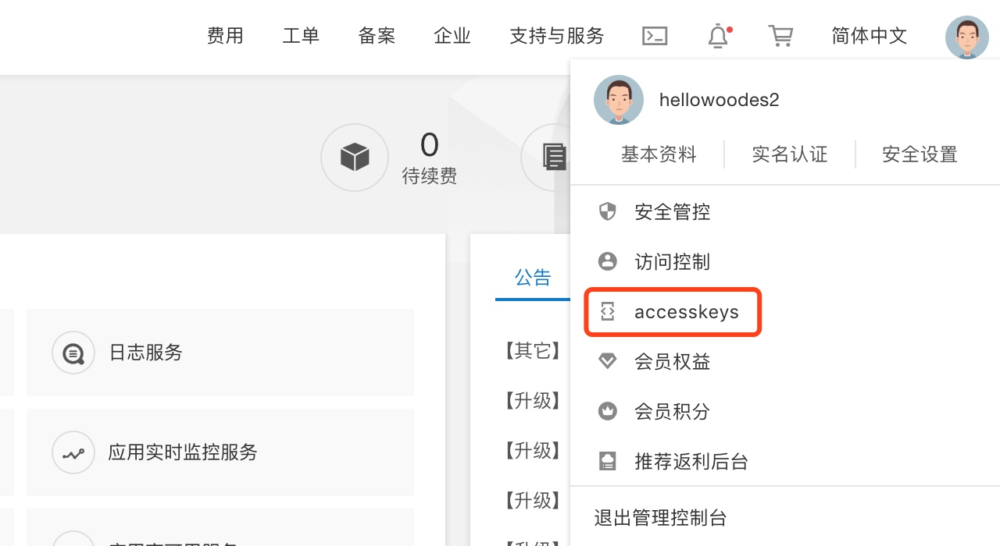
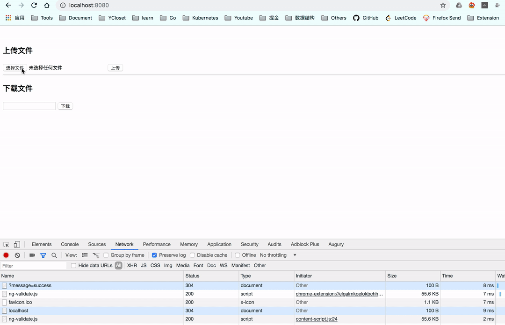

# Spring Cloud 使用阿里云 OSS

> `org.springframework.cloud:spring-cloud-starter-alicloud-oss` 就是对 oss-sdk 的简单封装，在应用启动的时候初始化并注入了 Oss Client，具体使用可以参考 [OSS Java SDK](https://help.aliyun.com/document_detail/32008.html?spm=a2c4g.11186623.6.708.757a2ebbWLJUZv)

## 创建应用

- 添加依赖 build.gradle 

```gradle
ext {
    springCloudVersion = 'Greenwich.SR1'
    springCloudAlibabaVersion = '2.1.0.RELEASE'
}

dependencyManagement {
    imports {
        mavenBom "org.springframework.cloud:spring-cloud-dependencies:${springCloudVersion}"
        mavenBom "com.alibaba.cloud:spring-cloud-alibaba-dependencies:${springCloudAlibabaVersion}"
    }
}

dependencies {
        compile('com.alibaba.cloud:spring-cloud-starter-alicloud-oss')
}
```

- 添加配置 application.properties

```properties
spring.application.name=oss
spring.cloud.alicloud.access-key=YOUR_AK
spring.cloud.alicloud.secret-key=YOUR_SK
spring.cloud.alicloud.oss.endpoint=oss-cn-beijing.aliyuncs.com
spring.cloud.alicloud.bucket=YOUR_BUCKET_NAME
spring.servlet.multipart.max-file-size=10MB
```

AK 和 SK 可以在阿里云的 Access Key 中获取



- 添加接口 BaseController.java

接口用于跳转到首页

```java
@Controller
public class BaseController {

    @GetMapping("/")
    public String index() {
        return "index.html";
    }
}
```

- 添加页面 index.html

```html
<!DOCTYPE html>
<html lang="en">
<head>
    <meta charset="UTF-8">
    <title>Alibaba Cloud OSS</title>
</head>
<body>
<br>
<h3>上传文件</h3>
<form action="/upload" method="post" enctype="multipart/form-data">
    <input type="file" name="fileName">
    <input type="submit" value="上传">
</form>

<hr>
<h3>下载文件</h3>
<form action="/download" method="get">
    <input type="text" name="fileName">
    <input type="submit" value="下载">
</form>
</body>
</html>
<script type="text/javascript">
    window.onload = function () {
        if (window.location.href.split('message=')[1] !== undefined) {
            alert("上传成功");
        }
    }
</script>
```

- 上传下载接口 OssController.java

```java
import com.aliyun.oss.OSS;
import com.aliyun.oss.model.OSSObject;
import org.apache.commons.codec.CharEncoding;
import org.apache.tomcat.util.http.fileupload.IOUtils;
import org.springframework.beans.factory.annotation.Autowired;
import org.springframework.beans.factory.annotation.Value;
import org.springframework.http.MediaType;
import org.springframework.stereotype.Controller;
import org.springframework.web.bind.annotation.*;
import org.springframework.web.multipart.MultipartFile;

import javax.servlet.http.HttpServletResponse;
import java.io.IOException;

/**
 * @author HelloWood
 */
@Controller
public class OssController {

    @Autowired
    private OSS oss;

    @Value("${spring.cloud.alicloud.bucket}")
    private String BUCKET_NAME;

    @RequestMapping(
            value = "/upload",
            method = RequestMethod.POST,
            produces = MediaType.MULTIPART_FORM_DATA_VALUE
    )
    public String upload(@RequestParam("fileName") MultipartFile multipartFile) {

        try {
            oss.putObject(BUCKET_NAME, multipartFile.getOriginalFilename(), multipartFile.getInputStream());
        } catch (IOException e) {
            e.printStackTrace();
        }
        return "redirect:/?message=success";
    }

    @GetMapping("/download")
    @ResponseBody
    public void download(@RequestParam String fileName, HttpServletResponse response) {
        OSSObject ossObject = oss.getObject(BUCKET_NAME, fileName);

        if (ossObject != null) {
            try {
                response.setCharacterEncoding(CharEncoding.UTF_8);
                response.setContentType("application/octet-stream");
                response.setHeader("Content-Disposition", "attachment;filename=" + fileName);
                IOUtils.copy(ossObject.getObjectContent(), response.getOutputStream());
                response.flushBuffer();
            } catch (IOException e) {
                e.printStackTrace();
            }
        }
    }
}
```


## 测试

- 启动应用 

- 上传 



- 下载 


