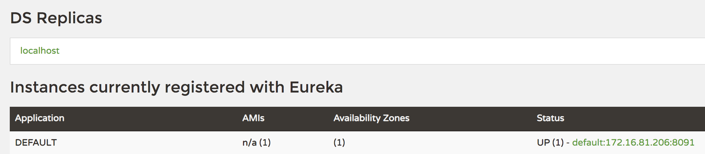

# Spring Cloud 使用Feign 实现远程调用，Eureka 作为注册中心，使用 Seata 实现分布式事务

> 使用 Seata 作为分布式事务组件，注册中心使用 Eureka，使用 MySQL 数据库和 MyBatis，使用 Feign 实现远程调用


## 环境准备

### 创建数据库及表

- 业务表

```sql
DROP DATABASE IF EXISTS seata;
CREATE DATABASE seata;
USE seata;

CREATE TABLE account
(
    id               INT AUTO_INCREMENT PRIMARY KEY,
    balance          INT,
    last_update_time DATETIME DEFAULT now() ON UPDATE now()
);

CREATE TABLE product
(
    id               INT AUTO_INCREMENT PRIMARY KEY,
    price            INT,
    stock            INT,
    last_update_time DATETIME DEFAULT now() ON UPDATE now()
);

CREATE TABLE orders
(
    id               INT AUTO_INCREMENT PRIMARY KEY,
    user_id          INT,
    product_id       INT,
    pay_amount       INT,
    status           VARCHAR(100),
    add_time         DATETIME DEFAULT now(),
    last_update_time DATETIME DEFAULT now() ON UPDATE now()
);

INSERT INTO account (id, balance)
VALUES (1, 10);
INSERT INTO product (id, price, stock)
VALUES (1, 5, 10);

CREATE TABLE undo_log
(
    id            BIGINT(20)   NOT NULL AUTO_INCREMENT,
    branch_id     BIGINT(20)   NOT NULL,
    xid           VARCHAR(100) NOT NULL,
    context       VARCHAR(128) NOT NULL,
    rollback_info LONGBLOB     NOT NULL,
    log_status    INT(11)      NOT NULL,
    log_created   DATETIME     NOT NULL,
    log_modified  DATETIME     NOT NULL,
    ext           VARCHAR(100) DEFAULT NULL,
    PRIMARY KEY (id),
    UNIQUE KEY ux_undo_log (xid, branch_id)
) ENGINE = InnoDB
  AUTO_INCREMENT = 1
  DEFAULT CHARSET = utf8;
```

### 启动 Eureka

启动项目的 Eureka 服务

### 启动 Seata Server 

在 [Seata Release](https://github.com/seata/seata/releases) 下载最新版本的 Seata Server，解压

- 修改registry.conf

```
registry {
  # file 、nacos 、eureka、redis、zk、consul、etcd3、sofa
  type = "eureka"

  eureka {
    serviceUrl = "http://localhost:8761/eureka"
    application = "default"
    weight = "1"
  }

}

config {
  # file、nacos 、apollo、zk、consul、etcd3
  type = "file"

  file {
    name = "file.conf"
  }
}
```


然后执行以下命令启动，需要注意的是 0.7.1版本中的启动命令也有改动

```bash
sh ./bin/seata-server.sh
```

待启动完成后访问 [http://localhost:8761/](http://localhost:8761/)，可以看到有一个名为 `default`的服务



## 测试

- 启动应用

先启动 Pay-Service 和 Storage-Service，启动完成后再启动Order-Service

- 测试成功场景

调用 placeOrder 接口，将 price 设置为 1，此时余额为 10，可以下单成功

```bash
curl -X POST \
  http://localhost:8081/order/placeOrder \
  -H 'Content-Type: application/json' \
  -d '{
    "userId": 1,
    "productId": 1,
    "price": 1
}'
```

此时返回结果为：

```json
{"success":true,"message":null,"data":null}
```

- 测试失败场景

设置 price 为 100，此时余额不足，会下单失败，pay-service会抛出异常，事务会回滚

```bash
curl -X POST \
  http://localhost:8081/order/placeOrder \
  -H 'Content-Type: application/json' \
  -d '{
    "userId": 1,
    "productId": 1,
    "price": 100
}'
```

查看 undo_log 的日志或者主键，可以看到在执行过程中有保存数据

如查看主键自增的值，在执行前后的值会发生变化

```sql
SELECT
    auto_increment
FROM information_schema.TABLES
WHERE TABLE_SCHEMA = 'seata'
  AND TABLE_NAME = 'undo_log'
```

## 注意 

### DataSourceProxy 配置

这里是尤其需要注意的，Seata 是通过代理数据源实现事务分支，所以需要配置 `io.seata.rm.datasource.DataSourceProxy` 的 Bean，且是 `@Primary`默认的数据源，否则事务不会回滚，无法实现分布式事务 

```java
@Configuration
public class DataSourceProxyConfig {

    @Bean
    @ConfigurationProperties(prefix = "spring.datasource")
    public DruidDataSource druidDataSource() {
        return new DruidDataSource();
    }

    @Primary
    @Bean
    public DataSourceProxy dataSource(DruidDataSource druidDataSource) {
        return new DataSourceProxy(druidDataSource);
    }
    
    @Bean
    public SqlSessionFactory sqlSessionFactoryBean(DataSourceProxy dataSourceProxy) throws Exception {
        SqlSessionFactoryBean sqlSessionFactoryBean = new SqlSessionFactoryBean();
        sqlSessionFactoryBean.setDataSource(dataSourceProxy);
        return sqlSessionFactoryBean.getObject();
    }    
}
```

如果使用的是 Hikari 数据源，需要修改数据源的配置，以及注入的 Bean 的配置前缀

```properties
spring.datasource.hikari.driver-class-name=com.mysql.cj.jdbc.Driver
spring.datasource.hikari.jdbc-url=jdbc:mysql://localhost:3306/seata?useUnicode=true&characterEncoding=utf8&allowMultiQueries=true&useSSL=false
spring.datasource.hikari.username=root
spring.datasource.hikari.password=123456
```

```java
    @Bean
    @ConfigurationProperties(prefix = "spring.datasource.hikari")
    public DataSource dataSource() {
        return new HikariDataSource();
    }
```

### Seata 的 service-group 配置

application.properties 里面的`tx-service-group`配置必须要和`file.conf`里面的`service`的`vgroup_mapping`的名称一致
 
```properties
spring.cloud.alibaba.seata.tx-service-group=storage-service-fescar-service-group
```

- file.conf

```properties
vgroup_mapping.storage-service-fescar-service-group = "default"
```

该配置在`org.springframework.cloud:spring-cloud-starter-alibaba-seata`中默认为`spring.application.name` +`-fescar-service-group`，在 Seata 0.7.1+ 中需要通过指定`spring.cloud.alibaba.seata.tx-service-group`覆盖

### 版本

需要注意的是当前Spring Boot 和 Spring Cloud 以及 Spring Cloud Alibaba 的版本号需要互相对应，否则可能会存在各种问题；具体可以参考[版本说明](https://github.com/spring-cloud-incubator/spring-cloud-alibaba/wiki/%E7%89%88%E6%9C%AC%E8%AF%B4%E6%98%8E)
