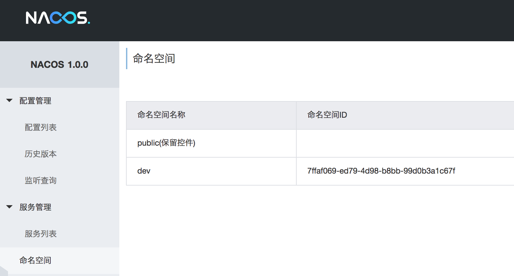
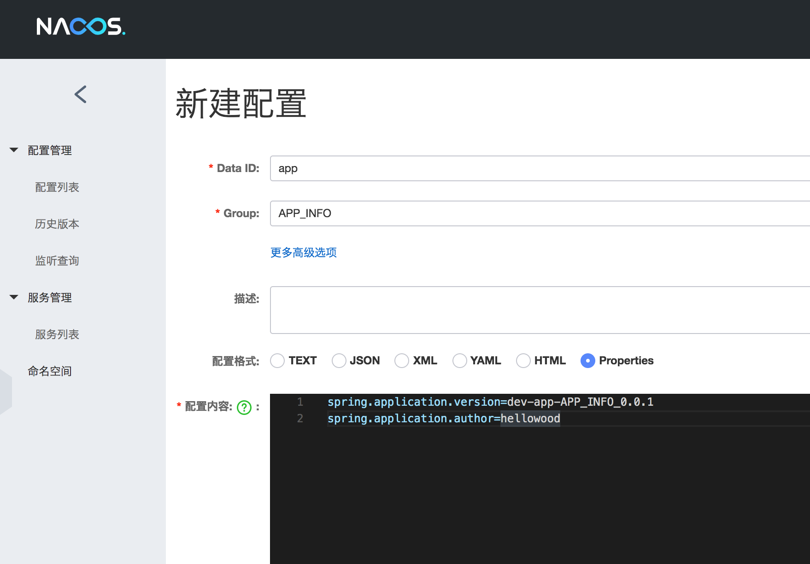
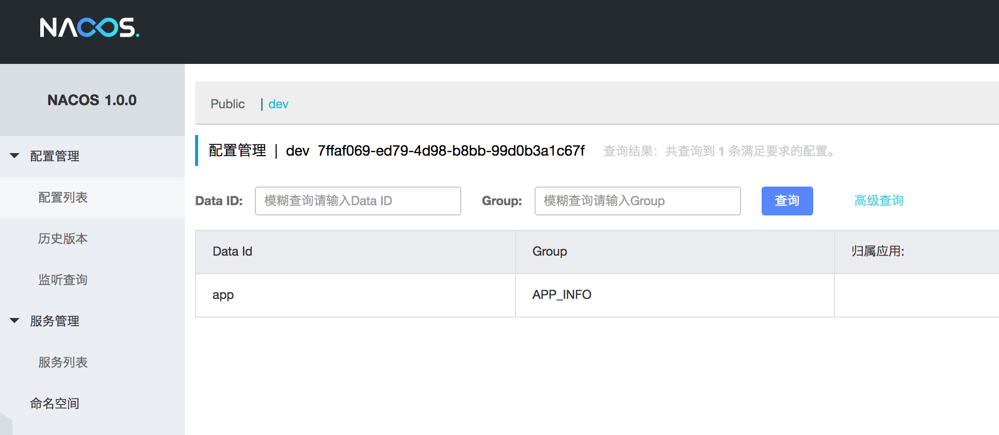
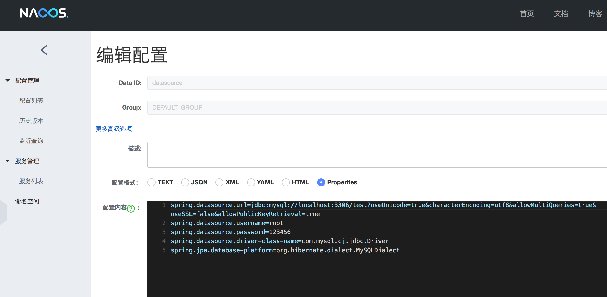

# Spring Boot 使用 Nacos 作为配置中心

> Nacos 是 阿里巴巴推出的用于微服务的配置管理和注册中心，和 Spring Config 相比可以使用 MySQL 或者文件作为配置存储，提供管理界面

## 启动 Nacos

有两种方式可以启动 Nacos，详细信息可以参考 [https://nacos.io/zh-cn/docs/quick-start.html](https://nacos.io/zh-cn/docs/quick-start.html)

- [下载](https://github.com/alibaba/nacos/releases) Nacos ，解压并启动

```bash
unzip nacos-server-$version.zip 或者 tar -xvf nacos-server-$version.tar.gz

cd nacos/bin

sh startup.sh -m standalone
```

- 用 Docker 启动 

```bash
docker run --name nacos -d -p 8848:8848 -e MODE=standalone nacos/nacos-server
```

启动完成后访问 [http://localhost:8848/nacos/](http://localhost:8848/nacos/)

## 添加配置

### 概念

- 命名空间(Namespace): 可以用于不同的环境，如生产环境，测试环境等
- 配置集(Data Id): 组织划分维度之一，一个系统或者应用可以有多个配置集，通常用类包名的命名规则
- 配置分组(Group): 对配置集进行分组，默认为 DEFAULT_GROUP，常见场景是不同的应用或者组件使用了相同的配置；如数据源(datasource)，MQ(mq_topic) 等

- 添加命名空间



- 添加配置  

```
spring.application.version=dev-app-APP_INFO_0.0.1
spring.application.author=hellowood
```





## 创建应用

- 添加依赖 build.gradle

```gradle
dependencies {
    compile('com.alibaba.boot:nacos-config-spring-boot-starter:0.2.1')
}
```

- 修改配置 application.properties

```
spring.application.name=nacos
nacos.config.server-addr=127.0.0.1:8848
nacos.config.namespace=7ffaf069-ed79-4d98-b8bb-99d0b3a1c67f
```

需要注意的是 nacos 的namespace 不是名称，而是 Id，否则会获取不到属性

- NacosApplication.java

```
@SpringBootApplication
public class NacosApplication {

    public static void main(String[] args) {
        SpringApplication.run(NacosApplication.class, args);
    }

}
```

- 获取属性 AppInfoController.java，指定使用哪个配置集(dataId) 和配置分组(group)

```java
@RestController
@RequestMapping("/app-info")
@NacosPropertySource(dataId = "app", groupId = "APP_INFO", autoRefreshed = true)
public class AppInfoController {

    @NacosValue(value = "${spring.application.version}", autoRefreshed = true)
    private String version;

    @GetMapping
    @ResponseBody
    public String appInfo() {
        return version;
    }
}
```

## 测试

- 启动应用 

- 获取属性

```bash
curl localhost:8080/app-info

dev-app-APP_INFO_0.0.1%
```

- 在 Nacos 中修改应用信息，将版本号改为dev-app-APP_INFO_0.0.2并发布

```
spring.application.version=dev-app-APP_INFO_0.0.2
spring.application.author=hellowood
```

- 再次获取配置，已经变成修改后的配置信息

```bash
curl localhost:8080/app-info

dev-app-APP_INFO_0.0.2%
```

#### 多个Group

- 添加数据源配置



- DataSourceController.java

```java
@RestController
@RequestMapping("/datasource")
@NacosPropertySource(dataId = "datasource", autoRefreshed = true)
public class DataSourceController {

    @NacosValue(value = "${spring.datasource.url}", autoRefreshed = true)
    private String datasource;

    @GetMapping
    @ResponseBody
    public String datasource() {
        return datasource;
    }
}
```

- 获取属性

```bash
curl localhost:8080/datasource

jdbc:mysql://localhost:3306/test?useUnicode=true&characterEncoding=utf8&allowMultiQueries=true&useSSL=false&allowPublicKeyRetrieval=true%
```